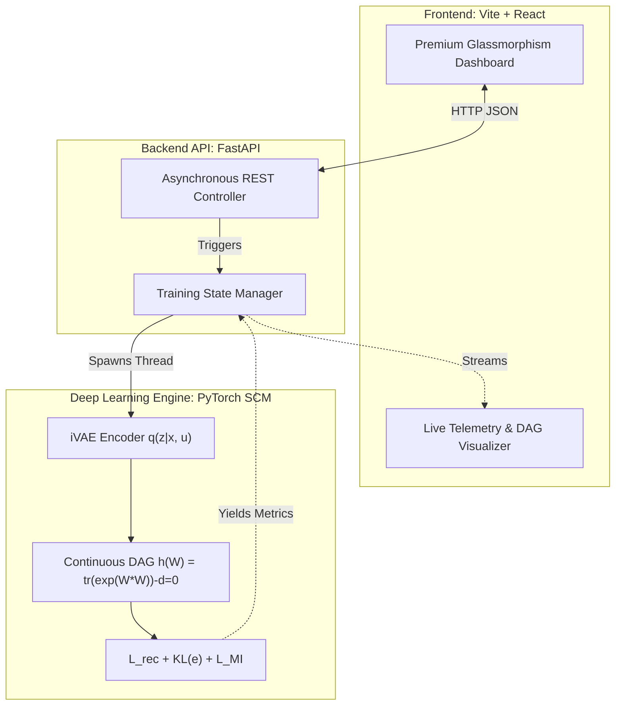

# 🧠 MICoRe: Identifiable Causal Representation Learning

[](https://opensource.org/licenses/MIT)
[](https://pytorch.org/)
[](https://fastapi.tiangolo.com/)
[](https://vitejs.dev/)

**MICoRe** is a research-grade, end-to-end framework for **Identifiable Causal Representation Learning**. It bridges the gap between deep representation learning and causal discovery by extracting disentangled, causally linked latent variables from high-dimensional observational data using **sparse soft interventions**.

## 🚀 Key Innovations & Architectural Breakthroughs

### 1. Resolving the "Architecture Collision" (Exogenous Prior Binding)
A foundational mathematical collision exists between Identifiable VAEs (which assume mutually independent latents) and continuous DAG learning like NOTEARS (which enforce causal dependencies among latents). 

MICoRe solves this by constructing a Structural Causal Model (SCM) directly over the latent space:
$$ Z = f(Z; W) + \epsilon $$

**The Breakthrough:** Instead of placing the conditional iVAE prior on $Z$, MICoRe maps the independent prior $p(\epsilon | u)$ onto the **exogenous noise variables** $\epsilon$. Because the causal adjacency matrix $W$ is constrained to be a Directed Acyclic Graph (DAG), the Jacobian determinant of the transformation $\epsilon \to Z$ is strictly 1, enabling exact and tractable log-likelihood estimation without sacrificing structural identifiability.

### 2. Minimal Intervention Regularization ($L_{MI}$)
Traditional methods struggle to isolate causal mechanisms under soft interventions without heavy supervision. MICoRe introduces a mathematically rigorous $L_1$ sparsity penalty applied directly to the shift in causal mechanisms across environments $u$:

$$ L_{MI} = \lambda \sum_{u > 0} \sum_i ||\theta_{i,u} - \theta_{i,0}||_1 $$

This theoretically grounds the model, forcing it to assume that nature's interventions are sparse. Only the variables directly intervened upon will exhibit a shift in their prior distributions ($\mu, \sigma$), while the rest remain invariant.

---

## 🏗️ System Architecture

MICoRe is deployed as a high-performance full-stack application, divorcing heavy SCM computations from telemetry monitoring.



## 📊 Disentanglement & Evaluation Metrics
The framework rigorously evaluates the identifiability and graph recovery accuracy live during training:
- **Mean Correlation Coefficient (MCC):** Resolves permutations via the Hungarian matching algorithm to definitively prove latent identifiability.
- **Structural Hamming Distance (SHD):** Quantifies the exact number of edge additions, deletions, and reversals required to match the ground-truth DAG.
- **DCI Matrix:** Analyzes Disentanglement, Completeness, and Informativeness using Lasso/Random Forest predictors on the latent embeddings.

---

## 💻 Quick Start & Deployment

### 1. Initialize the SCM Engine (Backend)
The backend is powered by FastAPI, allowing asynchronous Augmented Lagrangian optimization loops without blocking telemetry.
```bash
# Install dependencies
pip install -r requirements.txt

# Boot the API server
python api/server.py
```
*Server runs on `http://localhost:8000`*

### 2. Launch the Deep Space Terminal (Frontend)
The frontend is a bespoke React UI built on Vite, utilizing a highly optimized, custom-coded CSS design system (Dark Premium Green aesthetic).
```bash
# Navigate to UI
cd frontend

# Install Node modules
npm install

# Start the Vite HMR server
npm run dev
```
*Terminal runs on `http://localhost:5173`*

---
**Maintained by:** [@bnssaanirudh](https://github.com/bnssaanirudh) | **License:** MIT
